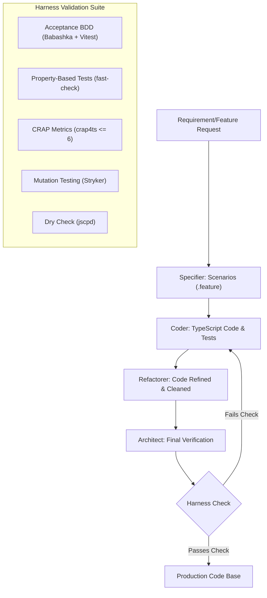

# Generator & SwarmForge Workspace 🍲🤖

This repository is a **SwarmForge** playground configured to run a multi-agent development workflow tailored for **TypeScript projects**. The primary purpose of this workspace is to showcase how a collaborative team of AI agents can autonomously develop features, refactor code, and maintain architectural integrity guided by a strict quality harness.

> [!NOTE]
> The **Indian Recipe Generator** single-page application under `src/` is **simply a target application** to demonstrate this agentic development pipeline. The core focus of this repository is the agent pipeline configuration, prompt roles, and the verification harness.

---

## 🤖 SwarmForge Multi-Agent Workflow

Inspired by **[SwarmForge](https://github.com/unclebob/swarm-forge)**—a collaborative multi-agent developer system by **Robert C. Martin (Uncle Bob)**—this workflow orchestrates four specialized developer agents to implement code changes collaboratively:

1. **Specifier (`specifier`)**: Takes user intents and designs precise Gherkin/Cucumber behavior scenarios under the `features/` directory.
2. **Coder (`coder`)**: Translates approved specifications into TypeScript code using Test-Driven Development (TDD) principles.
3. **Refactorer (`refactorer`)**: Optimizes the coder's implementation (improving readability, eliminating duplicate blocks, and reducing complexity metrics).
4. **Architect (`architect`)**: Reviews module boundaries, executes rigorous verification checks (mutation testing, duplication audits), and manages commits across worktrees.

---

## 🚀 How to Add New Features Using SwarmForge

You can develop and extend the application by instructing the agent pipeline to build new features on top of the existing UI and codebase:

### 1. Start the Swarm Daemon
Launch the tmux-based SwarmForge orchestrator:
```bash
./swarm
```
This boots tmux sessions for each agent role (`specifier`, `coder`, `refactorer`, `architect`) and starts monitoring the handoff directories.

### 2. Write and Send a Feature Request
Create a draft text file (e.g., `add-favorites-feature.txt`) describing the user intent or feature you want to build on top of the UI (e.g., adding a "Favorite Recipe" button):
```rfc822
to: specifier
type: note
priority: 50
message: Add a 'Favorite' button to each recipe item and display the list of saved favorites below the details.
```

Submit this draft to the swarm inbox:
```bash
./swarmforge/scripts/swarm_handoff.sh add-favorites-feature.txt
```

### 3. Review and Approve Specifications
The **Specifier** agent consumes this task, writes a Gherkin specification (under `features/`), and presents the draft specifications. Once you review and approve, the specifier commits the specification and hands the task over to the **Coder**.

### 4. Automated Development & Verification
Once the specification is approved, the remaining agent flow proceeds autonomously:
1. **Coder** implements the code in a dedicated worktree and writes unit tests.
2. **Refactorer** ensures code meets clean code guidelines and reduces complexity.
3. **Architect** runs the complete verification suite, merges the code back to the main branch, and signals completion.

---

## 🛡️ The TypeScript Quality Harness

To enable autonomous agents to develop robust, maintainable, and clean TypeScript code, this repository implements a **multi-layered Quality Harness**. This harness establishes strict guidelines and programmatic checks that agents must pass before code is merged. 

### Harness Workflow



---

### Harness Layers Explained

#### 1. CRAP Testing (Change Risk Anti-Patterns)
The **CRAP metric** evaluates how complex and poorly-tested the code is. It is measured using the `crap4ts` package. The mathematical formula for CRAP is:

$$CRAP(m) = C(m)^2 \times (1 - Cov(m))^3 + C(m)$$

Where:
- $C(m)$ is the **Cyclomatic Complexity** of the method.
- $Cov(m)$ is the **Code Coverage** (between `0` and `1`).

*   **Rule Enforced**: The workspace enforces a strict CRAP threshold of **`6`** (configured in [crap4ts.config.ts](crap4ts.config.ts)).
*   **Agent Impact**: Agents cannot simply write highly complex logic without testing it. If a method's complexity increases, its test coverage must also increase significantly to keep the CRAP score below 6. This prevents agents from introducing hard-to-maintain code blocks.

#### 2. Mutation Testing (Stryker)
Traditional code coverage metrics are easily fooled by tests that execute lines without checking assertions. To prevent this, the harness uses **Mutation Testing** via **Stryker Mutator**.

*   **How it works**: Stryker modifies the TypeScript source code in memory (e.g., changing `>` to `<`, flipping `true` to `false`, or removing operations) to create "mutants." It then runs the test suite. If the test suite passes, the mutant "survived" (indicating a weak test suite). If the tests fail, the mutant is "killed" (indicating a strong test suite).
*   **Agent Impact**: An agent cannot commit superficial tests. The tests must assert specific outcomes to kill all generated mutants, ensuring a highly resilient application logic.

#### 3. Property-Based Testing (`fast-check`)
Instead of testing logic with pre-determined inputs, we use property-based testing to verify code invariants under thousands of randomized inputs.

*   **How it works**: Uses `fast-check` (configured in [vite.config.property.ts](vite.config.property.ts)) to fuzz input data generators (e.g., generating arrays of varying length, malformed JSON, boundary values).
*   **Agent Impact**: In AI-driven applications, responses from models (such as Gemini) can contain unexpected structures. Property-based tests ensure the parser in [src/recipe-service.ts](src/recipe-service.ts) is robust and handles errors gracefully without crashing the UI.

#### 4. Acceptance BDD (Babashka + Vitest)
All features start with user stories and scenarios written in Gherkin syntax (e.g., [features/recipe_filter.feature](features/recipe_filter.feature)).

*   **How it works**: The harness uses **Babashka** (`bb` command-line utility) to parse features into JSON, which are then compiled into executable Vitest acceptance tests using a custom test runner adapter.
*   **Agent Impact**: Enforces alignment between business intent and technical implementation.

#### 5. Code Duplication Auditing (`jscpd`)
To maintain DRY (Don't Repeat Yourself) design principles, the `jscpd` tool is run continuously.
*   **Rule Enforced**: Code duplication threshold checks flag copy-pasted blocks.
*   **Agent Impact**: Forces agents to extract common code into utility functions rather than duplicating logic across different files.

---

## 🍲 Target Application: Indian Recipe Generator

The project application is a responsive, single-page web app that interacts with the Gemini API to fetch recipe suggestions and steps dynamically.

### Features
- **Ingredient-Based Suggestions**: Input ingredients (e.g., *paneer, spinach*) to get exactly 5 matching recipe suggestions.
- **Diet Filters**: Easily filter suggestions between **All**, **Veg Only**, and **Non-Veg Only**.
- **Detailed Recipe Instructions**: Click "Get Recipe" to fetch ingredients and cooking steps dynamically.
- **Mock Fallback**: Runs out-of-the-box using local mock data if no Gemini API key is configured or when `?mock=true` query param is present.

---

## 🛠️ Tech Stack & Tooling

- **Frontend**: Vanilla HTML5, TypeScript, and native CSS3 built with **Vite**.
- **AI Integration**: [@google/genai](https://www.npmjs.com/package/@google/genai) to query `gemini-3.5-flash`.
- **Testing framework**: Vitest (Unit/Acceptance/Property), Playwright (E2E), Stryker Mutator (Mutation testing).
- **Static Analysis**: `jscpd` for copy-paste checking, `crap4ts` for code complexity metric checks.

---

## 📁 Project Structure

```text
├── features/                     # Gherkin BDD/acceptance scenarios
├── scripts/                      # Test generation and execution scripts
├── src/                          # TypeScript source code
│   ├── acceptance/               # Autogenerated Vitest acceptance tests
│   ├── index.css                 # Vanilla CSS stylesheets
│   ├── main.ts                   # App entrypoint & service bootstrap
│   ├── mock-recipe-service.ts    # Fallback recipe database
│   ├── recipe-components.ts      # Core reusable UI components
│   ├── recipe-list-components.ts # List & item rendering components
│   ├── recipe-service.ts         # Gemini AI API caller & parser
│   └── recipe-generator.ts       # Application controller
├── swarmforge/                   # SwarmForge prompt configurations and roles
├── tests-e2e/                    # Playwright end-to-end spec tests
├── index.html                    # Root HTML document
├── package.json                  # Scripts & dependencies
└── tsconfig.json                 # TypeScript config
```

---

## ⚙️ Setup & Installation

### Prerequisites

- [Node.js](https://nodejs.org/) (v18 or higher)
- [pnpm](https://pnpm.io/) or `npm`
- [Babashka](https://babashka.org/) (required to parse Gherkin `.feature` files during Acceptance Tests)

### Step-by-Step Setup

1. **Install Dependencies:**
   ```bash
   pnpm install
   # or
   npm install
   ```

2. **Configure Environment Variables:**
   Create a `.env` file in the root directory:
   ```bash
   cp .env.example .env
   ```
   Add your Gemini API Key:
   ```env
   VITE_GEMINI_API_KEY=your_gemini_api_key_here
   VITE_GEMINI_MODEL=gemini-3.5-flash
   ```

3. **Launch local dev server:**
   ```bash
   pnpm run dev
   # or
   npm run dev
   ```
   Open `http://localhost:5173`.

### Offline/Mock Mode
To run without calling the Gemini API, visit:
`http://localhost:5173/?mock=true`
This uses `MockRecipeService` which matches predefined mock inputs.

---

## 🧪 Testing & Verification

The codebase includes multiple test layers to ensure complete functional coverage.

| Test Command | Type | Description |
| :--- | :--- | :--- |
| `npm run test` | Unit | Executes standard unit tests via Vitest. |
| `npm run test:acceptance` | Acceptance | Compiles Gherkin feature files via Babashka and runs Vitest specs. |
| `npm run test:property` | Property | Runs randomized property tests using `fast-check`. |
| `npm run test:e2e` | End-to-End | Launches headless browser checks via Playwright. |
| `npm run test:mutation` | Mutation | Measures test suite quality using Stryker Mutator. |
| `npm run test:dry` | Copy-Paste | Detects code duplication using `jscpd`. |
